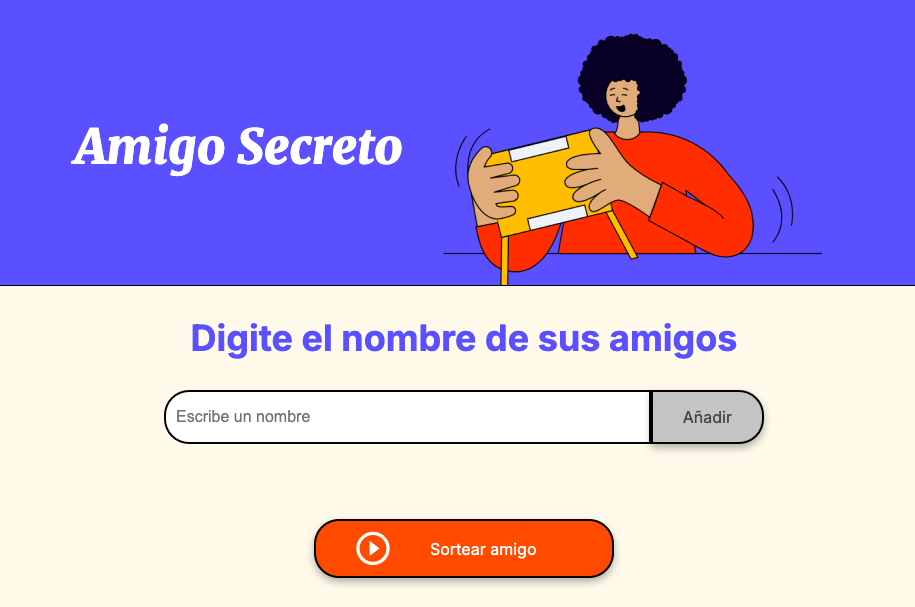

# Challenge Amigo Secreto

## Description 

Secret friend
In this challenge, I developed an application that allows users to enter names of friends
into a list and then conduct a random drawing to determine who the "Secret Friend" is.

The user must add names using a text field and an "Add" button. The names entered will be displayed
in a visible list on the page, and at the end, a "Raffle Friend" button will select one of the names randomly, 
displaying the result on the screen.

## Features

- Add Names: Users will type a friend's name into a text field and add it to a visible list by clicking "Add."
  
- Validate input: If the text field is empty, the program will show an alert asking for a valid name.

- View list: The names entered will appear in a list below the input field.

- Random Draw: By clicking the "Friend Draw" button, a name will be randomly selected from the list and displayed on the page.

  

  ##  Acceso al proyecto 📁

- You can download the project from github with the steps to follow: from your search engine you can put repo.new
  followed by Repository name* ; and follow the instructions once your repo has been named.

  [Github.com](https://github.com/)

  ## or create a new repository on the command line

  echo "# test" >> README.md
git init
git add README.md
git commit -m "first commit"
git branch -M main
git remote add origin https://github.com/userName/test.git
git push -u origin main

## …or push an existing repository from the command line

git remote add origin https://github.com/userName/test.git
git branch -M main
git push -u origin main

### THEN YOU OPEN IT FROM YOUR TERMINAL WITH THE COMMAND; code .

## Tecnologias Utilizadas 
- HTML
- CSS
- JAVASCRIPT
- VSCODE
- LINUX
- GITHUB
